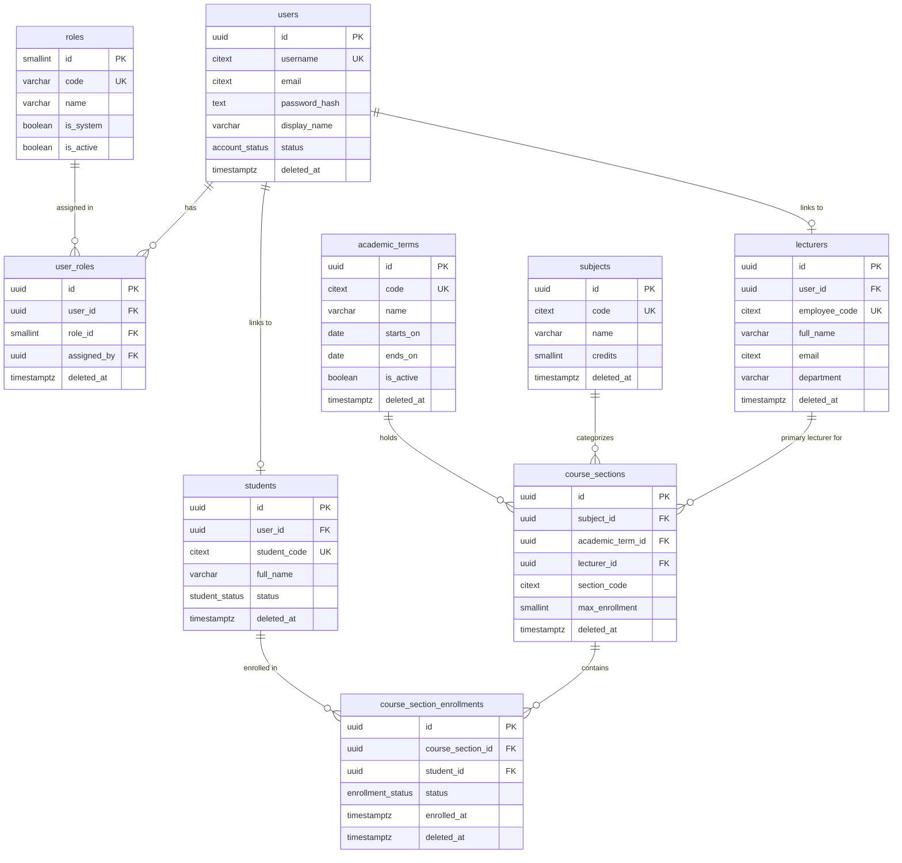
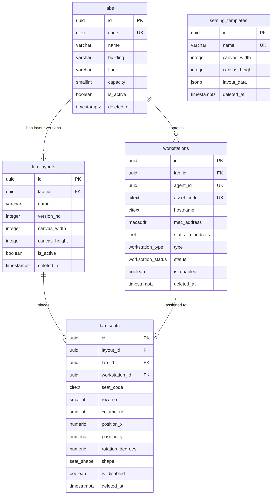
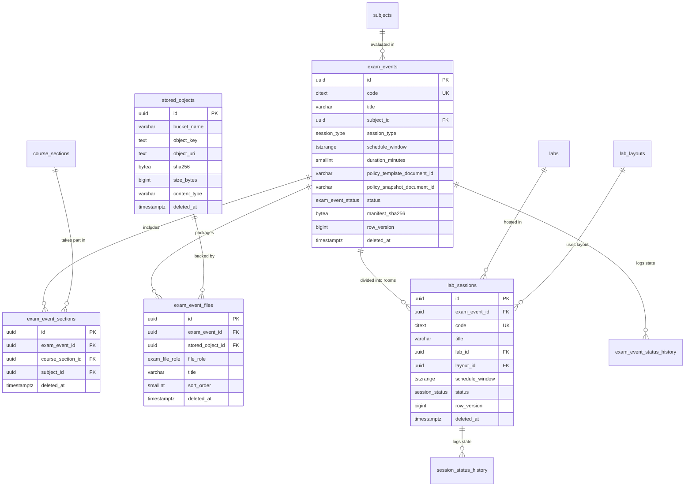
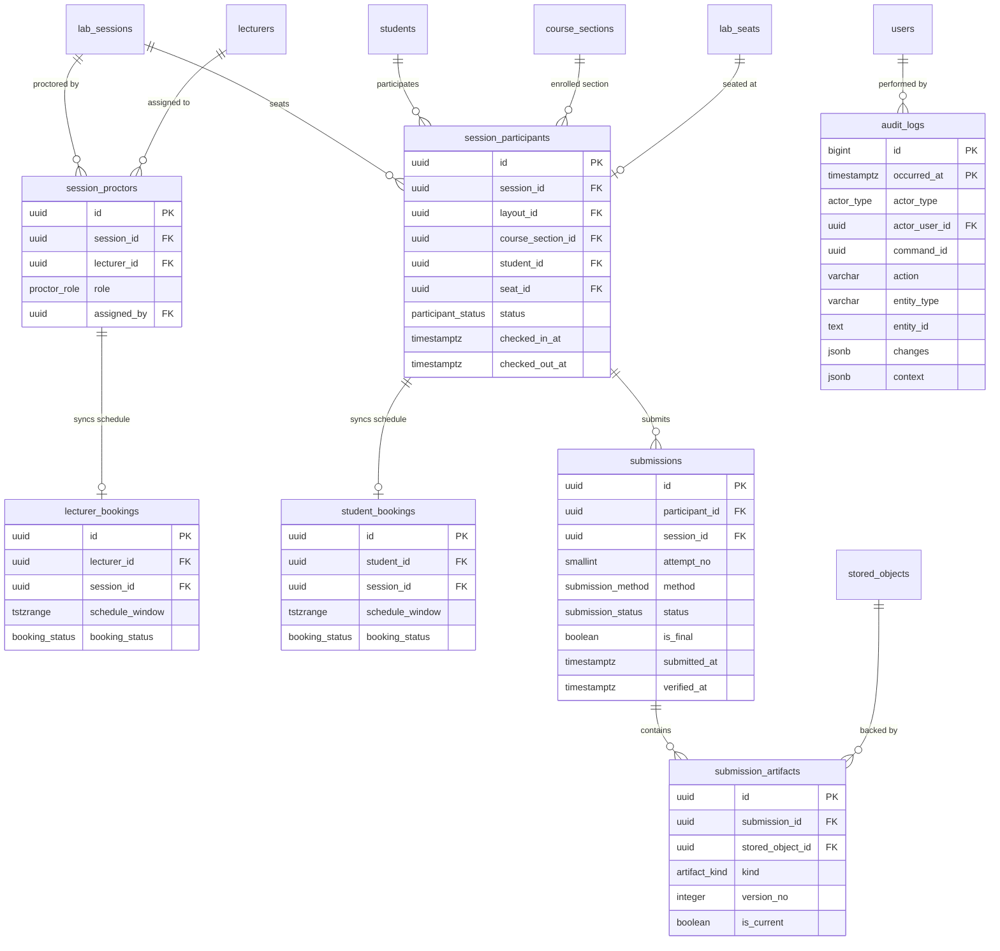
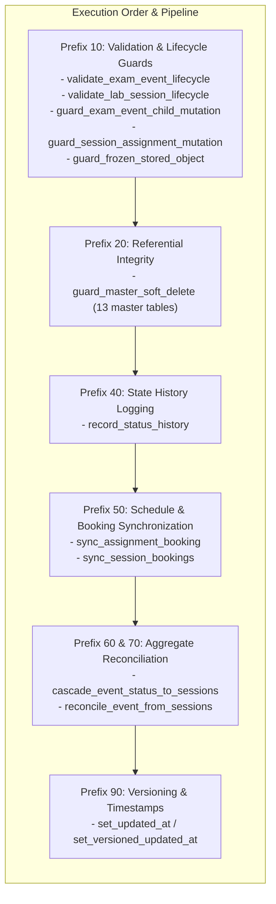
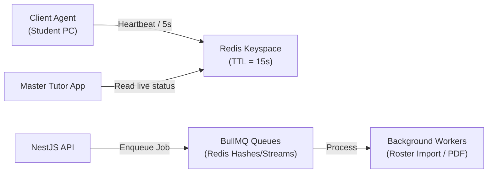

# CINE — Database Architecture, Schemas, and Design

This document provides a comprehensive specification of the database architecture, schema definitions, constraints, triggers, and polyglot persistence design for the **CINE (Hệ thống quản lý phòng máy / Lab Exam Management System)** project.

---

## Table of Contents

1. [Architectural Overview & Polyglot Persistence](#1-architectural-overview--polyglot-persistence)
2. [Data Access Strategy & Schema-First Paradigm](#2-data-access-strategy--schema-first-paradigm)
3. [PostgreSQL Extensions & Custom Types (Enums)](#3-postgresql-extensions--custom-types-enums)
4. [Entity Relationship Diagrams (ERD)](#4-entity-relationship-diagrams-erd)
   - [4.1 Identity, Access Control & Master Data](#41-identity-access-control--master-data)
   - [4.2 Lab Infrastructure & Seating Layouts](#42-lab-infrastructure--seating-layouts)
   - [4.3 Exam Events, Scheduling & Lab Sessions](#43-exam-events-scheduling--lab-sessions)
   - [4.4 Rosters, Submissions & Audit Logging](#44-rosters-submissions--audit-logging)
5. [Detailed Data Dictionary](#5-detailed-data-dictionary)
   - [5.1 Identity & RBAC Domain](#51-identity--rbac-domain)
   - [5.2 Academic Master Data Domain](#52-academic-master-data-domain)
   - [5.3 Lab & Seating Master Data Domain](#53-lab--seating-master-data-domain)
   - [5.4 Storage & Object Metadata Domain](#54-storage--object-metadata-domain)
   - [5.5 Exam Event Aggregate Domain](#55-exam-event-aggregate-domain)
   - [5.6 Lab Session & Scheduling Domain](#56-lab-session--scheduling-domain)
   - [5.7 Materialized Bookings & Conflict Prevention Domain](#57-materialized-bookings--conflict-prevention-domain)
   - [5.8 Status History & Lifecycle Audit Domain](#58-status-history--lifecycle-audit-domain)
   - [5.9 Exam Submissions Domain](#59-exam-submissions-domain)
   - [5.10 System Audit Logs (Partitioned)](#510-system-audit-logs-partitioned)
6. [Database Functions, Triggers & Business Invariants](#6-database-functions-triggers--business-invariants)
   - [6.1 Concurrency & Schedule Overlap Prevention (GiST Exclusion)](#61-concurrency--schedule-overlap-prevention-gist-exclusion)
   - [6.2 State Machine Transitions & Lifecycle Guards](#62-state-machine-transitions--lifecycle-guards)
   - [6.3 Referential Integrity on Soft Deletes](#63-referential-integrity-on-soft-deletes)
   - [6.4 Immutable Append-Only Tables](#64-immutable-append-only-tables)
   - [6.5 Automated Timestamps & Optimistic Versioning](#65-automated-timestamps--optimistic-versioning)
7. [Indexing & Search Strategy](#7-indexing--search-strategy)
8. [NoSQL & Storage Layers](#8-nosql--storage-layers)
   - [8.1 MongoDB (Policy Templates & Telemetry Logs)](#81-mongodb-policy-templates--telemetry-logs)
   - [8.2 Redis (Live State, Heartbeats & Distributed Queues)](#82-redis-live-state-heartbeats--distributed-queues)
   - [8.3 MinIO / S3 (Object Storage)](#83-minio--s3-object-storage)

---

## 1. Architectural Overview & Polyglot Persistence

The CINE platform employs a **polyglot persistence model**, assigning specialized data stores to workloads that match their strengths:

```mermaid
flowchart TD
    subgraph Client Layer
        WebPortal["Web Management Portal\n(Next.js 15)"]
        TutorApp["Master Tutor Desktop App\n(Lecturer App)"]
        ClientAgent["Client Agent\n(Student Workstation)"]
    end

    subgraph Application & Backend Layer
        NestAPI["NestJS Modular Monolith API\n(Port 4000)"]
        BullMQ["BullMQ Job Workers\n(Excel / Hash / Reports)"]
    end

    subgraph Polyglot Data Layer
        subgraph PostgreSQL["PostgreSQL 16 (Primary RDBMS)"]
            PG_Schema["Schema: lab_management\n- Relational Master Data\n- RBAC & Accounts\n- Lab Layouts & Seating\n- Exam Events & Sessions\n- GiST Conflict Protection\n- Partitioned Audit Logs"]
        end

        subgraph MongoDB["MongoDB 7 (Document Store)"]
            MG_Doc["- Exam Policy Templates\n- Immutable Policy Snapshots\n- AI Monitoring Telemetry\n- Workstation Violation Logs"]
        end

        subgraph Redis["Redis 7 (In-Memory Data Store)"]
            RD_Cache["- Agent/Tutor Heartbeats\n- Live Workstation State\n- BullMQ Job Queues\n- Distributed Locks"]
        end

        subgraph MinIO["MinIO (S3-Compatible Object Store)"]
            S3_Buckets["- Exam Packages (PDF, Attachments)\n- Student Submissions & Backups\n- SHA-256 Verified Artifacts"]
        end
    end

    WebPortal -->|REST / OpenAPI| NestAPI
    TutorApp -->|REST / WebSockets| NestAPI
    ClientAgent -->|Agent Push / Heartbeats| NestAPI

    NestAPI -->|TypeORM 0.3 (SQL-First)| PostgreSQL
    NestAPI -->|Mongoose| MongoDB
    NestAPI -->|ioredis| Redis
    NestAPI -->|AWS S3 / MinIO SDK| MinIO
    BullMQ -->|Queue Processing| Redis
```

### Persistence Responsibilities Matrix

| Datastore | Engine | Primary Responsibilities | Consistency Model |
| :--- | :--- | :--- | :--- |
| **Primary Catalog** | PostgreSQL 16 | Relational entities, RBAC, master data, lab layout geometry, exam schedules, proctor/participant bookings, immutable status history, submissions, partitioned audit log. | Strong ACID, Serialized / Repeatable Read, Triggers & GiST exclusion |
| **Policy & Logs** | MongoDB 7 | Flexible exam lockdown policies (blacklisted apps, whitelisted URLs, peripheral rules), policy snapshots, live student process violations, AI monitoring logs. | Document-level atomicity, Eventual read consistency |
| **Live State & Cache** | Redis 7 | Live workstation heartbeats, proctoring session presence, BullMQ distributed background queue state. | In-memory, sub-millisecond, ephemeral / snapshot |
| **Object Store** | MinIO (S3) | Unstructured binary assets: exam question papers, answer templates, student submitted source codes/archives. | Strong consistency per object, SHA-256 digest validation |

---

## 2. Data Access Strategy & Schema-First Paradigm

In this project, the **PostgreSQL schema is schema-first**:
1. **DBA-Authored DDL as Single Source of Truth**: The full relational schema is authored directly in SQL (`apps/api/src/database/migrations/sql/0001_initial_schema.sql`). Advanced PostgreSQL constructs (GiST exclusion constraints, composite foreign keys, trigger-based state machines, range types, GIN trigram indexes, partition tables) are expressed natively in DDL. Incremental TypeORM migrations are not used; a clean database applies this one script.
2. **TypeORM `synchronize: false`**: TypeORM entities in `apps/api/src/*/entities/*.entity.ts` are strictly query and type mapping models. TypeORM never auto-generates or alters DDL.
3. **Database-Level Error Mapping**: PostgreSQL error codes are intercepted by `PostgresExceptionFilter` in NestJS:
   - `23505` (Unique Violation) $\rightarrow$ `409 Conflict`
   - `23P01` (Exclusion Violation - booking/room conflict) $\rightarrow$ `409 Conflict`
   - `23503` (Foreign Key Violation / Soft-Delete Guard trigger) $\rightarrow$ `409 Conflict`
   - `23514` (Check Violation) $\rightarrow$ `400 Bad Request`
4. **Dedicated PostgreSQL Schema**: All project objects live inside the `lab_management` schema rather than the default `public` schema.

---

## 3. PostgreSQL Extensions & Custom Types (Enums)

### 3.1 Installed Extensions
- `pgcrypto`: Generates cryptographically strong random UUIDv4 (`gen_random_uuid()`).
- `citext`: Case-insensitive text types for usernames, emails, asset codes, and subject codes.
- `pg_trgm`: Trigram matching for fast fuzzy search on Vietnamese student and lecturer names.
- `btree_gist`: Enables B-tree operators in GiST indexes, powering exclusion constraints on scalar + range pairs.

### 3.2 Custom Enum Types

| Enum Type Name | Allowed Values | Domain Usage |
| :--- | :--- | :--- |
| `account_status` | `pending`, `active`, `locked`, `disabled` | User account lifecycle |
| `actor_type` | `user`, `system` | Status transitions and audit log actors |
| `student_status` | `active`, `graduated` | Student lifecycle |
| `enrollment_status` | `active`, `dropped`, `withdrawn` | Course section enrollment state |
| `workstation_status` | `available`, `maintenance`, `broken`, `retired` | Hardware operational status |
| `workstation_type` | `master`, `client` | Tutor master PC vs student client PC |
| `seat_shape` | `rect`, `circle`, `diamond` | Canvas seat glyph in a lab layout |
| `session_type` | `exam`, `practice` | Exam event and session category |
| `exam_event_status` | `draft`, `scheduled`, `active`, `completed`, `cancelled`, `aborted` | Master exam event state machine |
| `session_status` | `draft`, `scheduled`, `active`, `completed`, `cancelled`, `aborted` | Lab room session state machine |
| `participant_status` | `registered`, `checked_in`, `absent`, `submitted`, `disqualified` | Student proctoring state |
| `proctor_role` | `lead`, `assistant` | Faculty role in a lab session |
| `booking_status` | `tentative`, `reserved`, `released` | Materialized person scheduling |
| `exam_file_role` | `question`, `attachment`, `answer_template`, `guide` | Exam attachment classification |
| `submission_method` | `agent_push`, `tutor_collect`, `web_upload`, `manual_import` | Exam upload channel |
| `submission_status` | `received`, `verified`, `rejected`, `revoked`, `superseded` | Submission validation state |
| `artifact_kind` | `primary`, `backup`, `resubmission` | Submission file artifact kind |

---

## 4. Entity Relationship Diagrams (ERD)

### 4.1 Identity, Access Control & Master Data



---

### 4.2 Lab Infrastructure & Seating Layouts



---

### 4.3 Exam Events, Scheduling & Lab Sessions



---

### 4.4 Rosters, Submissions & Audit Logging



---

## 5. Detailed Data Dictionary

All tables are located in PostgreSQL schema `lab_management`.

### 5.1 Identity & RBAC Domain

#### Table: `roles`
Stores coarse-grained access control roles. Seeded with `admin`, `operator`, `lecturer`, `student`.
- `id` (`SMALLINT GENERATED ALWAYS AS IDENTITY PRIMARY KEY`): Unique role ID.
- `code` (`VARCHAR(32) NOT NULL UNIQUE`): Role identifier (e.g. `admin`). Constraint: `^[a-z][a-z0-9_]{1,31}$`.
- `name` (`VARCHAR(100) NOT NULL`): Human-readable name.
- `description` (`TEXT`): Detailed role summary.
- `is_system` (`BOOLEAN NOT NULL DEFAULT FALSE`): System-managed roles cannot be deleted.
- `is_active` (`BOOLEAN NOT NULL DEFAULT TRUE`): Active toggle.
- `created_at`, `updated_at` (`TIMESTAMPTZ NOT NULL DEFAULT now()`).

#### Table: `users`
Core login credentials and account lifecycle states.
- `id` (`UUID PRIMARY KEY DEFAULT gen_random_uuid()`): Unique account identifier.
- `username` (`CITEXT NOT NULL`): Case-insensitive username. Format: `^[A-Za-z0-9._-]{3,64}$`.
- `email` (`CITEXT`): Case-insensitive email.
- `password_hash` (`TEXT NOT NULL`): Argon2id password hash string ($\ge 20$ chars).
- `display_name` (`VARCHAR(150) NOT NULL`): Display name.
- `phone` (`VARCHAR(20)`): Contact phone. Format: `^[+]?[0-9 ()-]{8,20}$`.
- `status` (`account_status NOT NULL DEFAULT 'pending'`): `pending`, `active`, `locked`, `disabled`.
- `last_login_at` (`TIMESTAMPTZ`): Timestamp of last successful authentication.
- `created_at`, `updated_at` (`TIMESTAMPTZ NOT NULL DEFAULT now()`).
- `deleted_at` (`TIMESTAMPTZ`): Soft-delete timestamp.
- **Indexes & Constraints**:
  - Partial Unique: `uq_users_username_active` on `(username) WHERE deleted_at IS NULL`.
  - Partial Unique: `uq_users_email_active` on `(email) WHERE deleted_at IS NULL AND email IS NOT NULL`.

#### Table: `user_roles`
User to Role many-to-many junction.
- `id` (`UUID PRIMARY KEY DEFAULT gen_random_uuid()`).
- `user_id` (`UUID NOT NULL REFERENCES users(id) ON DELETE RESTRICT`).
- `role_id` (`SMALLINT NOT NULL REFERENCES roles(id) ON DELETE RESTRICT`).
- `assigned_by` (`UUID REFERENCES users(id) ON DELETE RESTRICT`).
- `created_at`, `updated_at` (`TIMESTAMPTZ NOT NULL DEFAULT now()`).
- `deleted_at` (`TIMESTAMPTZ`).
- **Indexes**: Partial Unique `uq_user_roles_active` on `(user_id, role_id) WHERE deleted_at IS NULL`.

---

### 5.2 Academic Master Data Domain

#### Table: `students`
Student master profile.
- `id` (`UUID PRIMARY KEY DEFAULT gen_random_uuid()`).
- `user_id` (`UUID REFERENCES users(id) ON DELETE RESTRICT`): Linked login account (if created).
- `student_code` (`CITEXT NOT NULL`): Student ID number (e.g. `20110001`). Format: `^[A-Za-z0-9._-]{3,32}$`.
- `full_name` (`VARCHAR(150) NOT NULL`): Full legal name.
- `status` (`student_status NOT NULL DEFAULT 'active'`): `active`, `graduated`.
- `created_at`, `updated_at`, `deleted_at` (`TIMESTAMPTZ`).
- **Indexes**:
  - Partial Unique: `uq_students_code_active` on `(student_code) WHERE deleted_at IS NULL`.
  - Partial Unique: `uq_students_user_active` on `(user_id) WHERE deleted_at IS NULL AND user_id IS NOT NULL`.
  - GIN Trigram: `idx_students_name_trgm` on `(full_name gin_trgm_ops) WHERE deleted_at IS NULL`.

#### Table: `lecturers`
Lecturers, teaching assistants, and exam proctors.
- `id` (`UUID PRIMARY KEY DEFAULT gen_random_uuid()`).
- `user_id` (`UUID REFERENCES users(id) ON DELETE RESTRICT`): Linked login account.
- `employee_code` (`CITEXT NOT NULL`): Staff code (e.g. `GV0123`).
- `full_name` (`VARCHAR(150) NOT NULL`): Full name.
- `email` (`CITEXT`): Faculty email.
- `phone` (`VARCHAR(20)`): Contact phone.
- `department` (`VARCHAR(150)`): Academic department.
- `academic_title` (`VARCHAR(100)`): Title (e.g. `TS.`, `ThS.`, `PGS.TS.`).
- `created_at`, `updated_at`, `deleted_at` (`TIMESTAMPTZ`).
- **Indexes**:
  - Partial Unique: `uq_lecturers_code_active` on `(employee_code) WHERE deleted_at IS NULL`.
  - Partial Unique: `uq_lecturers_email_active` on `(email) WHERE deleted_at IS NULL AND email IS NOT NULL`.
  - GIN Trigram: `idx_lecturers_name_trgm` on `(full_name gin_trgm_ops) WHERE deleted_at IS NULL`.

#### Table: `subjects`
Curriculum courses/modules.
- `id` (`UUID PRIMARY KEY DEFAULT gen_random_uuid()`).
- `code` (`CITEXT NOT NULL`): Course code (e.g. `INT3306`).
- `name` (`VARCHAR(200) NOT NULL`): Course title.
- `credits` (`SMALLINT`): Number of credits (0–30).
- `description` (`TEXT`).
- `created_at`, `updated_at`, `deleted_at` (`TIMESTAMPTZ`).
- **Indexes**: Partial Unique `uq_subjects_code_active` on `(code) WHERE deleted_at IS NULL`.

#### Table: `academic_terms`
Semesters / school terms.
- `id` (`UUID PRIMARY KEY DEFAULT gen_random_uuid()`).
- `code` (`CITEXT NOT NULL`): Semester code (e.g. `2026_HK1`).
- `name` (`VARCHAR(150) NOT NULL`): Semester name.
- `starts_on`, `ends_on` (`DATE NOT NULL`): Dates where `ends_on >= starts_on`.
- `is_active` (`BOOLEAN NOT NULL DEFAULT TRUE`).
- `created_at`, `updated_at`, `deleted_at` (`TIMESTAMPTZ`).

#### Table: `course_sections`
Specific class offerings of a subject during an academic term.
- `id` (`UUID PRIMARY KEY DEFAULT gen_random_uuid()`).
- `subject_id` (`UUID NOT NULL REFERENCES subjects(id) ON DELETE RESTRICT`).
- `academic_term_id` (`UUID NOT NULL REFERENCES academic_terms(id) ON DELETE RESTRICT`).
- `lecturer_id` (`UUID REFERENCES lecturers(id) ON DELETE RESTRICT`): Primary lecturer.
- `section_code` (`CITEXT NOT NULL`): `{maHocPhan}{01-99}` (e.g. `422000279301`). The same code may exist in different academic terms.
- `nominal_class_code` (`VARCHAR(50)`): Administrative cohort code.
- `max_enrollment` (`SMALLINT`): Capacity ceiling ($> 0$).
- `name` (`VARCHAR(200)`): Descriptive section name.
- `created_at`, `updated_at`, `deleted_at` (`TIMESTAMPTZ`).
- **Unique Constraint**: `uq_course_sections_id_subject UNIQUE (id, subject_id)` (used for composite FKs).
- **Index**: Partial Unique `uq_course_sections_active` on `(academic_term_id, section_code) WHERE deleted_at IS NULL`.

#### Table: `course_section_enrollments`
Student class enrollment registry.
- `id` (`UUID PRIMARY KEY DEFAULT gen_random_uuid()`).
- `course_section_id` (`UUID NOT NULL REFERENCES course_sections(id) ON DELETE RESTRICT`).
- `student_id` (`UUID NOT NULL REFERENCES students(id) ON DELETE RESTRICT`).
- `status` (`enrollment_status NOT NULL DEFAULT 'active'`): `active`, `dropped`, `withdrawn`.
- `enrolled_at` (`TIMESTAMPTZ NOT NULL DEFAULT now()`).
- `created_at`, `updated_at`, `deleted_at` (`TIMESTAMPTZ`).
- **Index**: Partial Unique `uq_course_section_enrollments_active` on `(course_section_id, student_id) WHERE deleted_at IS NULL AND status = 'active'`.

---

### 5.3 Lab & Seating Master Data Domain

#### Table: `labs`
Physical computer labs.
- `id` (`UUID PRIMARY KEY DEFAULT gen_random_uuid()`).
- `code` (`CITEXT NOT NULL`): Lab identifier (e.g. `LAB_A101`).
- `name` (`VARCHAR(150) NOT NULL`): Lab room name.
- `building` (`VARCHAR(100)`), `floor` (`VARCHAR(30)`).
- `capacity` (`SMALLINT NOT NULL`): Total seating capacity ($> 0$).
- `description` (`TEXT`).
- `is_active` (`BOOLEAN NOT NULL DEFAULT TRUE`).
- `created_at`, `updated_at`, `deleted_at` (`TIMESTAMPTZ`).
- **Index**: Partial Unique `uq_labs_code_active` on `(code) WHERE deleted_at IS NULL`.

#### Table: `workstations`
Physical PC hardware inventory in a lab.
- `id` (`UUID PRIMARY KEY DEFAULT gen_random_uuid()`).
- `lab_id` (`UUID NOT NULL REFERENCES labs(id) ON DELETE RESTRICT`).
- `agent_id` (`UUID NOT NULL DEFAULT gen_random_uuid() UNIQUE`): Fixed identity UUID assigned to the Client Agent software installed on this machine.
- `asset_code` (`CITEXT NOT NULL`): Fixed university asset barcode.
- `hostname` (`CITEXT NOT NULL`): Network hostname in the lab LAN.
- `mac_address` (`MACADDR`): Primary network card physical MAC address.
- `static_ip_address` (`INET`): Assigned IPv4/IPv6 address.
- `serial_number`, `operating_system` (`VARCHAR`).
- `type` (`workstation_type NOT NULL DEFAULT 'client'`): `master` (tutor PC) or `client` (student PC).
- `status` (`workstation_status NOT NULL DEFAULT 'available'`): `available`, `maintenance`, `broken`, `retired`.
- `is_enabled` (`BOOLEAN NOT NULL DEFAULT TRUE`): Operational toggle.
- `notes` (`TEXT`).
- `created_at`, `updated_at`, `deleted_at` (`TIMESTAMPTZ`).
- **Unique Constraint**: `uq_workstations_id_lab UNIQUE (id, lab_id)` (used for composite FKs).
- **Index**: Partial Unique `uq_workstations_hostname_active` on `(lab_id, hostname) WHERE deleted_at IS NULL`.

#### Table: `lab_layouts`
2D visual layout versions for a lab room.
- `id` (`UUID PRIMARY KEY DEFAULT gen_random_uuid()`).
- `lab_id` (`UUID NOT NULL REFERENCES labs(id) ON DELETE RESTRICT`).
- `name` (`VARCHAR(150) NOT NULL`): Layout version name (e.g. `Standard 40-Seat Layout`).
- `version_no` (`INTEGER NOT NULL DEFAULT 1`).
- `canvas_width`, `canvas_height` (`INTEGER NOT NULL DEFAULT 1280, 720`): Canvas dimensions for React Konva editor.
- `is_active` (`BOOLEAN NOT NULL DEFAULT FALSE`): Only one layout can be active per lab at a time.
- `created_at`, `updated_at`, `deleted_at` (`TIMESTAMPTZ`).
- **Unique Constraint**: `uq_lab_layouts_id_lab UNIQUE (id, lab_id)` (used for composite FKs).
- **Index**: Partial Unique `uq_lab_layouts_one_active` on `(lab_id) WHERE deleted_at IS NULL AND is_active`.

#### Table: `lab_seats`
Coordinate grid and workstation placement inside a layout canvas.
- `id` (`UUID PRIMARY KEY DEFAULT gen_random_uuid()`).
- `layout_id` (`UUID NOT NULL`), `lab_id` (`UUID NOT NULL`).
- `workstation_id` (`UUID`): Workstation placed at this seat.
- `seat_code` (`CITEXT NOT NULL`): Seat identifier (e.g. `A01`, `B12`).
- `row_no`, `column_no` (`SMALLINT`): Logical matrix indices.
- `position_x`, `position_y` (`NUMERIC(10,2) NOT NULL`): 2D Canvas coordinates ($x, y \ge 0$).
- `rotation_degrees` (`NUMERIC(5,2) NOT NULL DEFAULT 0`): Rotation on canvas ($-360^\circ$ to $+360^\circ$).
- `shape` (`seat_shape NOT NULL DEFAULT 'rect'`): `rect`, `circle`, `diamond`.
- `is_disabled` (`BOOLEAN NOT NULL DEFAULT FALSE`): Mark seat broken/unavailable for exam seating.
- `notes` (`TEXT`).
- `created_at`, `updated_at`, `deleted_at` (`TIMESTAMPTZ`).
- **Foreign Keys**:
  - `(layout_id, lab_id) REFERENCES lab_layouts(id, lab_id) ON DELETE RESTRICT`
  - `(workstation_id, lab_id) REFERENCES workstations(id, lab_id) ON DELETE RESTRICT`
- **Unique Constraint**: `uq_lab_seats_id_layout UNIQUE (id, layout_id)` (used for composite FKs).
- **Index**: Partial Unique `uq_lab_seats_code_active` on `(layout_id, seat_code) WHERE deleted_at IS NULL`.

#### Table: `seating_templates`
Reusable, lab-agnostic seat blueprints for the layout editor.
- `id` (`UUID PRIMARY KEY DEFAULT gen_random_uuid()`).
- `name` (`VARCHAR(150) NOT NULL`): Unique among active templates.
- `description` (`TEXT`).
- `canvas_width`, `canvas_height` (`INTEGER NOT NULL DEFAULT 1280, 720`).
- `layout_data` (`JSONB NOT NULL DEFAULT '[]'`): JSON array of seat blueprints (`jsonb_typeof = 'array'`).
- `created_at`, `updated_at`, `deleted_at` (`TIMESTAMPTZ`).
- **Indexes**:
  - Partial Unique: `uq_seating_templates_name_active` on `(name) WHERE deleted_at IS NULL`.
  - B-tree: `idx_seating_templates_name` on `(name) WHERE deleted_at IS NULL`.

---

### 5.4 Storage & Object Metadata Domain

#### Table: `stored_objects`
Immutable catalog of verified files uploaded to MinIO object storage.
- `id` (`UUID PRIMARY KEY DEFAULT gen_random_uuid()`).
- `bucket_name` (`VARCHAR(63) NOT NULL`): Target S3/MinIO bucket.
- `object_key` (`TEXT NOT NULL`): Path key inside the bucket.
- `object_uri` (`TEXT NOT NULL`): Canonical URI (e.g. `s3://exam-packages/2026/midterm.zip`).
- `sha256` (`BYTEA NOT NULL`): Cryptographic binary digest (32 bytes).
- `size_bytes` (`BIGINT NOT NULL`): File size in bytes.
- `content_type` (`VARCHAR(255)`), `etag` (`VARCHAR(128)`).
- `uploaded_by` (`UUID REFERENCES users(id) ON DELETE RESTRICT`).
- `created_at`, `updated_at`, `deleted_at` (`TIMESTAMPTZ`).
- **Indexes**:
  - Partial Unique: `uq_stored_objects_location_active` on `(bucket_name, object_key) WHERE deleted_at IS NULL`.
  - B-tree: `idx_stored_objects_sha256` on `(sha256) WHERE deleted_at IS NULL`.

---

### 5.5 Exam Event Aggregate Domain

#### Table: `exam_events`
Master aggregate root for an examination or supervised practice session.
- `id` (`UUID PRIMARY KEY DEFAULT gen_random_uuid()`).
- `code` (`CITEXT NOT NULL`): Unique exam code (e.g. `EXAM_2026_HK1_INT3306_MID`).
- `title` (`VARCHAR(250) NOT NULL`): Event title.
- `subject_id` (`UUID NOT NULL REFERENCES subjects(id) ON DELETE RESTRICT`).
- `session_type` (`session_type NOT NULL`): `exam` or `practice`.
- `scheduled_start_at`, `scheduled_end_at` (`TIMESTAMPTZ NOT NULL`).
- `schedule_window` (`TSTZRANGE GENERATED ALWAYS AS (tstzrange(scheduled_start_at, scheduled_end_at, '[)')) STORED`).
- `duration_minutes` (`SMALLINT NOT NULL > 0`): Working duration.
- `policy_template_document_id` (`VARCHAR(64)`): MongoDB ObjectId for the selected policy template.
- `policy_snapshot_document_id` (`VARCHAR(64)`): MongoDB ObjectId of the frozen immutable policy snapshot.
- `status` (`exam_event_status NOT NULL DEFAULT 'draft'`): `draft`, `scheduled`, `active`, `completed`, `cancelled`, `aborted`.
- `actual_start_at`, `actual_end_at` (`TIMESTAMPTZ`).
- `manifest_sha256` (`BYTEA`): Merkle/SHA-256 package digest of all exam attachments; required before transitioning to `scheduled`.
- `manifest_published_at` (`TIMESTAMPTZ`).
- `row_version` (`BIGINT NOT NULL DEFAULT 0`): Optimistic concurrency token.
- `created_by` (`UUID REFERENCES users(id) ON DELETE RESTRICT`).
- `created_at`, `updated_at`, `deleted_at` (`TIMESTAMPTZ`).
- **Unique Constraint**: `uq_exam_events_id_subject UNIQUE (id, subject_id)` (used for composite FKs).
- **Index**: Partial Unique `uq_exam_events_code_active` on `(code) WHERE deleted_at IS NULL`.

#### Table: `exam_event_sections`
Enrolled course sections included in the exam event.
- `id` (`UUID PRIMARY KEY DEFAULT gen_random_uuid()`).
- `exam_event_id` (`UUID NOT NULL`), `course_section_id` (`UUID NOT NULL`), `subject_id` (`UUID NOT NULL`).
- `created_at`, `updated_at`, `deleted_at` (`TIMESTAMPTZ`).
- **Foreign Keys**:
  - `(exam_event_id, subject_id) REFERENCES exam_events(id, subject_id) ON DELETE RESTRICT`
  - `(course_section_id, subject_id) REFERENCES course_sections(id, subject_id) ON DELETE RESTRICT`
- **Index**: Partial Unique `uq_exam_event_sections_active` on `(exam_event_id, course_section_id) WHERE deleted_at IS NULL`.

#### Table: `exam_event_files`
Package attachments (exam papers, reference materials, answer templates).
- `id` (`UUID PRIMARY KEY DEFAULT gen_random_uuid()`).
- `exam_event_id` (`UUID NOT NULL REFERENCES exam_events(id) ON DELETE RESTRICT`).
- `stored_object_id` (`UUID NOT NULL REFERENCES stored_objects(id) ON DELETE RESTRICT`).
- `file_role` (`exam_file_role NOT NULL`): `question`, `attachment`, `answer_template`, `guide`.
- `title` (`VARCHAR(250)`), `sort_order` (`SMALLINT NOT NULL DEFAULT 0`).
- `created_at`, `updated_at`, `deleted_at` (`TIMESTAMPTZ`).
- **Index**: Partial Unique `uq_exam_event_files_order_active` on `(exam_event_id, file_role, sort_order) WHERE deleted_at IS NULL`.

---

### 5.6 Lab Session & Scheduling Domain

#### Table: `lab_sessions`
A single room instance belonging to an `exam_events` aggregate.
- `id` (`UUID PRIMARY KEY DEFAULT gen_random_uuid()`).
- `exam_event_id` (`UUID NOT NULL REFERENCES exam_events(id) ON DELETE RESTRICT`).
- `code` (`CITEXT NOT NULL`): Room session code (e.g. `SESSION_INT3306_LAB_A101`).
- `title` (`VARCHAR(250) NOT NULL`).
- `lab_id` (`UUID NOT NULL REFERENCES labs(id) ON DELETE RESTRICT`).
- `layout_id` (`UUID NOT NULL`).
- `scheduled_start_at`, `scheduled_end_at` (`TIMESTAMPTZ NOT NULL`).
- `schedule_window` (`TSTZRANGE GENERATED ALWAYS AS (tstzrange(scheduled_start_at, scheduled_end_at, '[)')) STORED`).
- `status` (`session_status NOT NULL DEFAULT 'draft'`).
- `actual_start_at`, `actual_end_at` (`TIMESTAMPTZ`).
- `row_version` (`BIGINT NOT NULL DEFAULT 0`).
- `created_by` (`UUID REFERENCES users(id) ON DELETE RESTRICT`).
- `created_at`, `updated_at`, `deleted_at` (`TIMESTAMPTZ`).
- **Foreign Key**: `(layout_id, lab_id) REFERENCES lab_layouts(id, lab_id) ON DELETE RESTRICT`.
- **Unique Constraints**: `(id, layout_id)` and `(id, exam_event_id)` (used for composite FKs).
- **GiST Exclusion Constraint**:
  ```sql
  CONSTRAINT ex_lab_sessions_no_overlap
      EXCLUDE USING gist (
          lab_id WITH =,
          schedule_window WITH &&
      )
      WHERE (deleted_at IS NULL AND status IN ('scheduled', 'active'))
      DEFERRABLE INITIALLY IMMEDIATE
  ```
  *Prevents scheduling overlapping sessions in the same physical lab.*

#### Table: `session_proctors`
Lecturers assigned to proctor a session.
- `id` (`UUID PRIMARY KEY DEFAULT gen_random_uuid()`).
- `session_id` (`UUID NOT NULL REFERENCES lab_sessions(id) ON DELETE RESTRICT`).
- `lecturer_id` (`UUID NOT NULL REFERENCES lecturers(id) ON DELETE RESTRICT`).
- `role` (`proctor_role NOT NULL DEFAULT 'assistant'`): `lead` or `assistant`.
- `assigned_by` (`UUID REFERENCES users(id) ON DELETE RESTRICT`).
- `created_at`, `updated_at` (`TIMESTAMPTZ NOT NULL DEFAULT now()`).
- **Unique Constraints**:
  - `(session_id, lecturer_id)`: A lecturer can only be assigned once per session.
  - Partial Unique: `uq_session_proctors_lead` on `(session_id) WHERE role = 'lead'` (Exactly one lead proctor allowed per session).

#### Table: `session_participants`
Student roster and seat assignments for a lab session.
- `id` (`UUID PRIMARY KEY DEFAULT gen_random_uuid()`).
- `session_id` (`UUID NOT NULL`), `layout_id` (`UUID NOT NULL`).
- `course_section_id` (`UUID NOT NULL REFERENCES course_sections(id) ON DELETE RESTRICT`).
- `student_id` (`UUID NOT NULL REFERENCES students(id) ON DELETE RESTRICT`).
- `seat_id` (`UUID`).
- `status` (`participant_status NOT NULL DEFAULT 'registered'`): `registered`, `checked_in`, `absent`, `submitted`, `disqualified`.
- `checked_in_at`, `checked_out_at` (`TIMESTAMPTZ`).
- `notes` (`TEXT`).
- `created_at`, `updated_at` (`TIMESTAMPTZ NOT NULL DEFAULT now()`).
- **Foreign Keys**:
  - `(session_id, layout_id) REFERENCES lab_sessions(id, layout_id) ON DELETE RESTRICT`
  - `(seat_id, layout_id) REFERENCES lab_seats(id, layout_id) ON DELETE RESTRICT`
- **Unique Constraints**:
  - `(session_id, student_id)`: A student cannot be registered multiple times in the same session.
  - Partial Unique: `uq_session_participants_seat` on `(session_id, seat_id) WHERE seat_id IS NOT NULL` (No double-seating).

---

### 5.7 Materialized Bookings & Conflict Prevention Domain

These tables are maintained by database triggers (`sync_assignment_booking` and `sync_session_bookings`) to enforce non-overlapping personal schedules across different sessions.

#### Table: `lecturer_bookings`
- `id` (`UUID PRIMARY KEY DEFAULT gen_random_uuid()`).
- `lecturer_id` (`UUID NOT NULL`), `session_id` (`UUID NOT NULL`).
- `schedule_window` (`TSTZRANGE NOT NULL`).
- `booking_status` (`booking_status NOT NULL DEFAULT 'tentative'`).
- `created_at`, `updated_at` (`TIMESTAMPTZ NOT NULL DEFAULT now()`).
- **Foreign Key**: `(session_id, lecturer_id) REFERENCES session_proctors(session_id, lecturer_id) ON UPDATE CASCADE ON DELETE CASCADE`.
- **GiST Exclusion Constraint**:
  ```sql
  CONSTRAINT ex_lecturer_bookings_no_overlap
      EXCLUDE USING gist (
          lecturer_id WITH =,
          schedule_window WITH &&
      )
      WHERE (booking_status = 'reserved')
      DEFERRABLE INITIALLY IMMEDIATE
  ```

#### Table: `student_bookings`
- `id` (`UUID PRIMARY KEY DEFAULT gen_random_uuid()`).
- `student_id` (`UUID NOT NULL`), `session_id` (`UUID NOT NULL`).
- `schedule_window` (`TSTZRANGE NOT NULL`).
- `booking_status` (`booking_status NOT NULL DEFAULT 'tentative'`).
- `created_at`, `updated_at` (`TIMESTAMPTZ NOT NULL DEFAULT now()`).
- **Foreign Key**: `(session_id, student_id) REFERENCES session_participants(session_id, student_id) ON UPDATE CASCADE ON DELETE CASCADE`.
- **GiST Exclusion Constraint**:
  ```sql
  CONSTRAINT ex_student_bookings_no_overlap
      EXCLUDE USING gist (
          student_id WITH =,
          schedule_window WITH &&
      )
      WHERE (booking_status = 'reserved')
      DEFERRABLE INITIALLY IMMEDIATE
  ```

---

### 5.8 Status History & Lifecycle Audit Domain

Append-only audit logs capturing full state transitions. Mutation/deletion is blocked by trigger `prevent_append_only_mutation()`.

#### Table: `exam_event_status_history`
- `id` (`BIGINT GENERATED ALWAYS AS IDENTITY PRIMARY KEY`).
- `exam_event_id` (`UUID NOT NULL REFERENCES exam_events(id) ON DELETE RESTRICT`).
- `from_status`, `to_status` (`exam_event_status`).
- `reason` (`TEXT NOT NULL`).
- `actor_type` (`actor_type NOT NULL`): `user` or `system`.
- `changed_by` (`UUID REFERENCES users(id) ON DELETE RESTRICT`).
- `command_id` (`UUID NOT NULL`).
- `created_at` (`TIMESTAMPTZ NOT NULL DEFAULT now()`).

#### Table: `session_status_history`
- `id` (`BIGINT GENERATED ALWAYS AS IDENTITY PRIMARY KEY`).
- `session_id` (`UUID NOT NULL REFERENCES lab_sessions(id) ON DELETE RESTRICT`).
- `from_status`, `to_status` (`session_status`).
- `reason` (`TEXT NOT NULL`), `actor_type` (`actor_type NOT NULL`), `changed_by` (`UUID`), `command_id` (`UUID`).
- `created_at` (`TIMESTAMPTZ NOT NULL DEFAULT now()`).

---

### 5.9 Exam Submissions Domain

#### Table: `submissions`
Tracks student submission attempts during an active or completed session.
- `id` (`UUID PRIMARY KEY DEFAULT gen_random_uuid()`).
- `participant_id` (`UUID NOT NULL`), `session_id` (`UUID NOT NULL`).
- `attempt_no` (`SMALLINT NOT NULL DEFAULT 1 > 0`).
- `method` (`submission_method NOT NULL`): `agent_push`, `tutor_collect`, `web_upload`, `manual_import`.
- `status` (`submission_status NOT NULL DEFAULT 'received'`).
- `submitted_at` (`TIMESTAMPTZ NOT NULL DEFAULT now()`).
- `client_reported_at`, `verified_at` (`TIMESTAMPTZ`).
- `received_by` (`UUID REFERENCES users(id) ON DELETE RESTRICT`).
- `is_final` (`BOOLEAN NOT NULL DEFAULT FALSE`).
- `notes` (`TEXT`).
- `created_at`, `updated_at` (`TIMESTAMPTZ NOT NULL DEFAULT now()`).
- **Foreign Key**: `(participant_id, session_id) REFERENCES session_participants(id, session_id) ON DELETE RESTRICT`.
- **Unique Constraints**:
  - `(participant_id, attempt_no)`: Attempt numbering uniqueness.
  - Partial Unique: `uq_submissions_final_effective` on `(participant_id) WHERE is_final AND status NOT IN ('revoked', 'superseded')`.

#### Table: `submission_artifacts`
Physical files linked to a student submission attempt.
- `id` (`UUID PRIMARY KEY DEFAULT gen_random_uuid()`).
- `submission_id` (`UUID NOT NULL REFERENCES submissions(id) ON DELETE RESTRICT`).
- `stored_object_id` (`UUID NOT NULL REFERENCES stored_objects(id) ON DELETE RESTRICT`).
- `kind` (`artifact_kind NOT NULL DEFAULT 'primary'`): `primary`, `backup`, `resubmission`.
- `version_no` (`INTEGER NOT NULL DEFAULT 1 > 0`).
- `is_current` (`BOOLEAN NOT NULL DEFAULT TRUE`).
- `created_at`, `updated_at` (`TIMESTAMPTZ NOT NULL DEFAULT now()`).
- **Indexes**:
  - Partial Unique: `uq_submission_artifacts_current` on `(submission_id, kind) WHERE is_current`.
  - Unique: `uq_submission_artifacts_version` on `(submission_id, kind, version_no)`.

---

### 5.10 System Audit Logs (Partitioned)

#### Table: `audit_logs`
Range-partitioned audit ledger recording system-wide administrative mutations.
- `id` (`BIGINT GENERATED ALWAYS AS IDENTITY`).
- `occurred_at` (`TIMESTAMPTZ NOT NULL DEFAULT now()`).
- `PRIMARY KEY (occurred_at, id)`.
- `actor_type` (`actor_type NOT NULL DEFAULT 'system'`).
- `actor_user_id` (`UUID REFERENCES users(id) ON DELETE RESTRICT`).
- `command_id` (`UUID NOT NULL DEFAULT gen_random_uuid()`).
- `action` (`VARCHAR(80) NOT NULL`).
- `entity_type` (`VARCHAR(80) NOT NULL`), `entity_id` (`TEXT NOT NULL`).
- `request_id` (`UUID`), `ip_address` (`INET`), `user_agent` (`TEXT`).
- `changes` (`JSONB NOT NULL DEFAULT '{}'::JSONB`): Key-value diff of updated attributes.
- `context` (`JSONB NOT NULL DEFAULT '{}'::JSONB`): Request context and metadata.
- `created_at` (`TIMESTAMPTZ NOT NULL DEFAULT now()`).
- **Partitioning Strategy**: `PARTITION BY RANGE (occurred_at)`.
- **Default Partition**: `audit_logs_default PARTITION OF audit_logs DEFAULT`.
- **Indexes**:
  - GIN: `idx_audit_logs_changes_gin` on `(changes jsonb_path_ops)`.
  - B-tree: `idx_audit_logs_entity_time` on `(entity_type, entity_id, occurred_at DESC)`.
  - B-tree: `idx_audit_logs_actor_time` on `(actor_user_id, occurred_at DESC)`.

---

## 6. Database Functions, Triggers & Business Invariants

The schema encodes critical domain logic and safety guarantees directly in PL/pgSQL database triggers.



### 6.1 Concurrency & Schedule Overlap Prevention (GiST Exclusion)
To guarantee zero double-booking under high concurrent load:
1. **Lab Room Overlaps**: Handled by `ex_lab_sessions_no_overlap` on `lab_sessions (lab_id WITH =, schedule_window WITH &&)`.
2. **Proctor Double-Booking**: Handled by `ex_lecturer_bookings_no_overlap` on `lecturer_bookings`.
3. **Student Multi-Session Overlaps**: Handled by `ex_student_bookings_no_overlap` on `student_bookings`.
4. **Trigger Synchronization**: `sync_assignment_booking()` and `sync_session_bookings()` automatically project session schedules into `lecturer_bookings` and `student_bookings`, transitioning status from `tentative` to `reserved` when a session moves to `scheduled` or `active`.

### 6.2 State Machine Transitions & Lifecycle Guards
- **Event Lifecycle State Machine**:
  - `draft` $\rightarrow$ `scheduled` or `cancelled`
  - `scheduled` $\rightarrow$ `active` or `cancelled`
  - `active` $\rightarrow$ `completed` or `aborted`
- **Manifest Locking Requirement**: Trigger `validate_exam_event_lifecycle()` enforces that an exam event **cannot** transition from `draft` to `scheduled` unless `manifest_sha256` and `manifest_published_at` are populated.
- **Child Mutation Guard**: Once an exam event or session moves past `draft`, `guard_exam_event_child_mutation()` blocks adding, deleting, or altering attached sections (`exam_event_sections`) and files (`exam_event_files`).

### 6.3 Referential Integrity on Soft Deletes
The trigger function `guard_master_soft_delete()` is attached to 13 master tables:
```sql
CREATE TRIGGER trg_20_<table>_soft_delete_guard
BEFORE UPDATE OF deleted_at ON <table>
FOR EACH ROW EXECUTE FUNCTION guard_master_soft_delete();
```
If a parent entity is soft-deleted (setting `deleted_at = now()`), the trigger dynamically checks whether active child rows (where `deleted_at IS NULL`) still reference it. If active children exist, it raises a `foreign_key_violation` (`23503`), cleanly mapped by the API to `409 Conflict`.

### 6.4 Immutable Append-Only Tables
The trigger `prevent_append_only_mutation()` is attached to:
- `exam_event_status_history`
- `session_status_history`
- `audit_logs`

Any attempted `UPDATE` or `DELETE` on these tables is unconditionally aborted with error code `object_not_in_prerequisite_state`.

### 6.5 Automated Timestamps & Optimistic Versioning
- `set_updated_at()`: Automatically updates `updated_at = clock_timestamp()` before any row update across 22 mutable tables.
- `set_versioned_updated_at()`: Increments `row_version = OLD.row_version + 1` on `exam_events` and `lab_sessions` for optimistic concurrency control.

---

## 7. Indexing & Search Strategy

| Index Type | Target Fields | Tables | Purpose & Rationale |
| :--- | :--- | :--- | :--- |
| **GIN Trigram (`gin_trgm_ops`)** | `full_name`, `name` | `students`, `lecturers`, `subjects`, `labs` | High-speed accent-insensitive fuzzy substring search over Vietnamese text (e.g. `ILIKE '%Nguyễn Văn%'`). |
| **GIN JSONB (`jsonb_path_ops`)** | `changes` | `audit_logs` | Rapid structural filtering on deep JSON audit change keys (e.g. `changes @> '{"status": "active"}'`). |
| **GiST (`btree_gist`)** | `lab_id / lecturer_id / student_id` + `schedule_window` | `lab_sessions`, `lecturer_bookings`, `student_bookings` | Temporal overlap query resolution and exclusion constraint backing. |
| **Active Partial Unique** | Unique identifiers `WHERE deleted_at IS NULL` | All 13 master entities | Enforces business uniqueness strictly among active rows, allowing historical re-use of soft-deleted codes/emails. |
| **Composite Filtering** | `(academic_term_id, subject_id)`, `(session_id, status)` | `course_sections`, `session_participants`, `submissions` | Eliminates table scans during high-frequency list and dashboard filtering queries. |

---

## 8. NoSQL & Storage Layers

### 8.1 MongoDB (Policy Templates & Telemetry Logs)

MongoDB 7 stores flexible, document-structured policies and high-volume live telemetry from student workstations.

#### Collection: `exam_policy_templates`
```json
{
  "_id": ObjectId("66d400000000000000000001"),
  "name": "Standard Programming Exam Policy",
  "description": "Allows IDEs and offline docs; blocks internet and external USB drives",
  "is_default": true,
  "created_by": "3fa85f64-5717-4562-b3fc-2c963f66afa6",
  "rules": {
    "process_whitelist": [
      { "name": "code.exe", "display_name": "Visual Studio Code" },
      { "name": "devenv.exe", "display_name": "Visual Studio" },
      { "name": "idea64.exe", "display_name": "IntelliJ IDEA" }
    ],
    "process_blacklist": [
      { "name": "discord.exe" },
      { "name": "telegram.exe" },
      { "name": "chrome.exe" }
    ],
    "network": {
      "mode": "whitelist_only",
      "allowed_domains": ["api.cine.edu.vn", "docs.python.org", "cppreference.com"]
    },
    "peripherals": {
      "allow_usb_storage": false,
      "allow_bluetooth": false,
      "allow_printer": false
    },
    "lockdown": {
      "block_task_manager": true,
      "block_clipboard_copy_out": true,
      "disable_multiple_monitors": true
    }
  },
  "created_at": ISODate("2026-08-20T08:00:00Z"),
  "updated_at": ISODate("2026-08-20T08:00:00Z")
}
```

#### Collection: `exam_policy_snapshots`
When an exam event is scheduled, its referenced template is copied into an immutable document in `exam_policy_snapshots`. Its `_id` is recorded in `exam_events.policy_snapshot_document_id` to ensure policy rules cannot change mid-exam.

#### Collection: `violation_telemetry_logs`
Time-series style telemetry pushed by the Client Agent on student workstations during exams.
```json
{
  "_id": ObjectId("66d400000000000000000099"),
  "session_id": "7b828e1c-5890-4c31-893f-a636ebc37b71",
  "student_id": "9f1d0b54-9fa2-43f1-a7eb-6c1f21db5977",
  "agent_id": "2b2bbcd3-6625-4122-83b6-1e9a3f283c74",
  "violation_type": "blacklisted_process_spawned",
  "severity": "high",
  "details": {
    "process_name": "telegram.exe",
    "pid": 14208,
    "command_line": "C:\\Users\\Student\\AppData\\Local\\Telegram\\telegram.exe",
    "window_title": "Telegram (3 messages)"
  },
  "occurred_at": ISODate("2026-08-26T09:15:32.412Z")
}
```

---

### 8.2 Redis (Live State, Heartbeats & Distributed Queues)

Redis 7 operates in-memory with sub-millisecond latency for live state tracking and async worker queues:



#### Redis Key Namespace Conventions:

| Key Pattern | Data Structure | TTL | Description |
| :--- | :--- | :--- | :--- |
| `agent:heartbeat:{agent_id}` | `HASH` | 15 seconds | Workstation live metrics: `{ "status": "online", "current_user": "20110001", "ip": "192.168.10.15", "cpu_percent": 12, "last_ping": 1756200000 }` |
| `session:active:{session_id}:agents` | `SET` | TTL of session | Set of `agent_id`s currently connected to the live session room. |
| `lock:exam_event:schedule:{event_id}`| `STRING` | 10 seconds | Distributed lock preventing concurrent duplicate scheduling runs. |
| `bull:excel-import:*` | `BullMQ Hash/Stream`| Job retention | Queue for asynchronous bulk student roster Excel parsing (`WEB-MD-05`). |
| `bull:manifest-hash:*` | `BullMQ Hash/Stream`| Job retention | Background Merkle/SHA-256 package computation on event freeze (`WEB-EXAM-08`). |
| `bull:report-export:*` | `BullMQ Hash/Stream`| Job retention | Server-side PDF/Excel report generation via `pdfmake`/`exceljs`. |

---

### 8.3 MinIO / S3 (Object Storage)

MinIO provides S3-compatible, distributed object storage for all binary assets.

```
MinIO Object Storage
├── exam-packages/                       # Exam question packages & attachments
│   └── {exam_event_id}/
│       ├── manifest.json                # SHA-256 manifest of all files in package
│       ├── questions/
│       │   └── de-thi-chinh-thuc.pdf
│       └── attachments/
│           ├── database-dump.sql
│           └── project-starter.zip
│
├── submissions/                         # Student exam submission archives
│   └── {session_id}/
│       └── {student_code}/
│           ├── attempt_1_primary.zip
│           └── attempt_1_backup.tar.gz
│
└── exports/                             # Server-generated report exports
    └── {academic_term_id}/
        └── grade-report-int3306.pdf
```

#### Storage Policies & Security:
1. **Presigned URLs**: Direct client-to-storage uploads and downloads use time-limited presigned URLs ($5–15$ minute expiration).
2. **Immutability & Frozen Object Guard**: Once a file is cataloged in `stored_objects` and linked to an active exam or submission, the PostgreSQL trigger `guard_frozen_stored_object()` blocks modifying or deleting its database record.
3. **Digest Verification**: Every stored artifact records its exact 32-byte `sha256` binary hash in `stored_objects.sha256`, verified upon upload completion.
